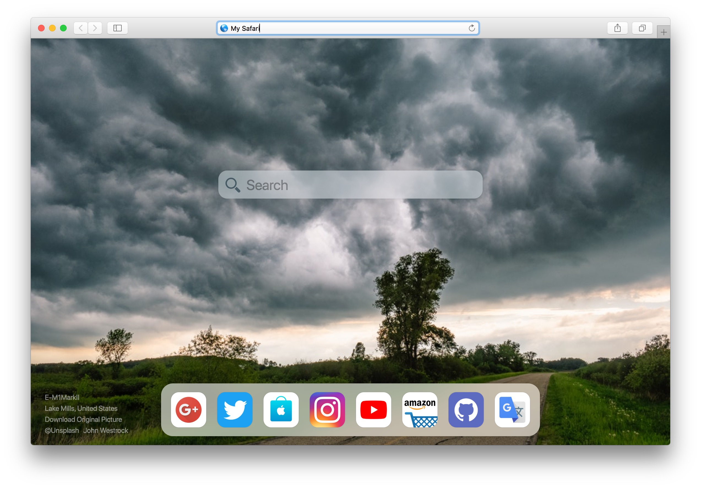
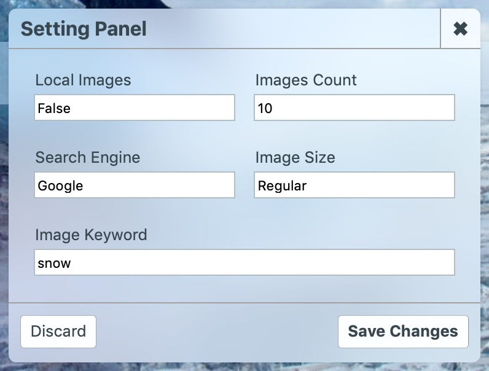

# Blured Newtab Page for Safari and Chrome

> See Demo at https://apollo.alice.expert/New-blured-Homepage/

## Features

- Beautiful Newtab Page For Your Browser

- Quick Visit Icons & Search Bar

- Change The Background Wallpaper Automatically

- You Can Use Your Awesome Images As Well!

## Usage

Download this repo, then set your homepage of browser to the local repo folder as below:

## Options

Click the gear icon at right bottom side to open option panel like this:

- Local Images

Use local images as wallpaper or not. Default value is False.

> **You can use your local images as wallpaper, only need to copy them to the background folder and rename as 01.jpg, 02.jpg, 03.jpg ...**

- Images Count (Available for Local Images)

When using local images, you must set the count of looping images.

- Search Engine

Select search engine between Google and Bing.

- Image Size (Available for Network Images)

Select image resolution for wallpaper, high resolution may cost more network data.

- Image Keywords (Available for Network Images)

Enter the image keywords which could be used to search wallpapers from image library.

## API Statement

This project uses the image search and storage API from https://unsplash.com , which is a perfect Hi-res image sharing website. Please visit https://unsplash.com/developers for more details.

## Donation

If you think this project is helpful to your development, you could just give me a cup of coffee. Thank you! ❤️

